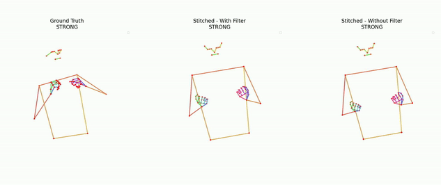

 

  

  

     A Novel Approach to Sign Language Production
  

<!-- ABOUT THE PROJECT -->
## Abstract
Sign Language Production (SLP) is a challenging task, given the limited resources available and the inherent diversity within sign data. As a result, previous works have suffered from the problem of regression to the mean, leading to under-articulated and incomprehensible signing. In this paper, we propose using dictionary examples and a learnt codebook of facial expressions to create expressive sign language sequences. However, simply concatenating signs and adding the face creates robotic and unnatural sequences. To address this we present a 7-step approach to effectively stitch sequences together. First, by normalizing each sign into a canonical pose, cropping, and stitching we create a continuous sequence. Then, by applying filtering in the frequency domain and resampling each sign, we create cohesive natural sequences that mimic the prosody found in the original data. We leverage a SignGAN model to map the output to a photo-realistic signer and present a complete Text-to-Sign (T2S) SLP pipeline. Our evaluation demonstrates the effectiveness of the approach, showcasing state-of-the-art performance across all datasets. Finally, a user evaluation shows our approach outperforms the baseline model and is capable of producing realistic sign language sequences.

![system_overview]
*Fig. 1: System overview of our approach to Sign Language Production (SLP) a) Spoken language to gloss, duration, facial token and cutoff Transformer. b) Stitcher that creates a pose sequence given a list of glosses, facial expressions, durations and a cutoff. c) The SignGAN module that produces a photo-realistic signer conditioned on a pose sequence.*

# SignStitchingDemos

Previous approaches have suffered from regression to the mean, caused by the models attempting to minimize their loss function. The easiest way for a pose regression models to do so is to predict a mean pose. The end results is under-articulated and incomprehensible signing. Additionally, previous works have implicitly modeled prosody, but due to the limited resources, it is often lost in production.

Here we use dictionary example to create the expressive sequence of sign. 

We start by showing the effect of different steps in the pipeline; 

![stitching_overview]
*Fig. 2: An overview of the stitching module*

Note to emphasize the effect of the different steps in the pipeline, we omit the addition of the face for now.

## Sign Cropping (step 3)

Here we show the original isolated sign on the left and the cropped sign on the right.
See how our method extracts the essential part of the sign.

| Isolated Sign                                                                  | Cropped Sign                                | 
|--------------------------------------------------------------------------------|---------------------------------------------|
|  |  |
|  |  |
|  |  |
|  |  |

## Smart Stitching (step 5)
To show the effect of the smart stitching module, we create a sequence that uses 9 frames to stitch the signs together (9 being the max number from frames the smart stitching module use to create the normal sequence).
To emphasize the need to select the correct number of frames for stitching, we also omit sequence resampling (step 6).

Left: Original sequence, Middle: Stitched sequence and Right: Stitched sequence with constant stitching.

Note the slow unnatural transition between the signs and the constant change in speed between signs.

## Filter Matching effect (step 7)

Left: Original sequence, Middle: Stitched sequence and Right: Stitched sequence without filter matching.

Note the quick movements without filter matching that are not present in the original sequence.

## Stitching Examples
Here we share more examples of sign stitching.

## Face Expression Dictionary
Using a Noise Substitution Vector Quantization (NSVQ) Transformer model, we learn a dictionary of facial expressions. Facial expressions are added to each gloss in step 4 of the stitching pipline. Thus, the output from the system includes both manual and non-manual features.

Here we show some examples from the dictionary;

 
 
 
 
 

## Translation example
Now we share example from the full translation system (Fig. 1 A + B + C). 

As shown above, when we have a high-quality dictionary with the same lexical variants as the original data, we can faithfully recreate sequences. 
On mDGS and PHOENIX14**T** we do not have such a dictionary, and thus the produced sequence contains a different lexical variants. 
So the motion or even had shape may vary from the original sequence. However, the substituted sign is valid. 

![translation_overview]
*Fig. 3: An overview of the Translation module.*

We also show a comparison between our approach and the baseline model, the progressive transformer (PT). See how model regresses to the mean and produces under-articulated and incomprehensible signing. 
Note we can only compare against the PT as it is the only SLP model that is publicly available.

Video 1: Original sequence, Video 2: Progressive Transformer, Video 3: Stitched sequence and Video 4: SignGAN output. 

### German Sign Language - Deutsche Gebärdensprache

**TEXT**: heute nacht dagegen fallen nur ein paar schneeflocken noch im norden und auch im südosten 	

**TRG**: HEUTE NACHT MEHR SCHNEE NORD SUEDOST	

**HYP**: HEUTE NACHT REGION SCHNEE NORD 

**TEXT**: am mittwoch ziehen im westen wolkenfelder auf bei acht bis sechzehn grad

**TRG**: MITTWOCH WEST WOLKE ACHT BIS SECHSZEHN

**HYP**: MITTWOCH WEST WOLKE HIMMEL ACHT BIS SECHSZEHN GRAD

**TEXT**: und nun die wettervorhersage für morgen dienstag den sechsten april

**TRG**: JETZT WETTER MORGEN DIENSTAG SECHSTE APRIL

**HYP**: JETZT WETTER MORGEN DIENSTAG SECHSTE APRIL

**TEXT**: und nun die wettervorhersage für morgen sonntag den sechsundzwanzigsten september

**TRG**: ETZT WETTER WIE-AUSSEHEN MORGEN SONNTAG SECHS ZWANZIG SEPTEMBER

**HYP**: JETZT WETTER WIE-AUSSEHEN MORGEN SONNTAG SECHS ZWANZIG SEPTEMBER

### British Sign Language (BSL)

**TEXT**: thats right indeed

**TRG**: RIGHT

**HYP**: RIGHT

**TEXT**: but what about the birthday party they said

**TRG**: G:HEY BIRTHDAY CONCENTRATE PT:PRO G:WELL INDECIPHERABLE CONCENTRATE G:WELL PT:PRO

**HYP**: G:WELL PT:PRO WHAT PT:POSS BIRTHDAY PT:PRO GOOD

### Failure Cases
#### BSL
Due to the lack of data, the translation model can struggle. Producing long repetitive sequences.

**TEXT**: so he just got on with it 

**TRG**: G:WELL G:ERM WAVE-HAND	

**HYP**: PT:PRO G:WELL PT:PRO LOOK PT:PRO

**TEXT**: then when i went home i told mum i wanted to stay at home 

**TRG**: PT:PRO PT:PRO GO HOME MUM PT:PRO WANT HOME

**HYP**: PT:PRO G:WELL PT:PRO HOME PT:PRO GOOD G:WELL PT:PRO G:WELL PT:PRO PT:PRO

#### DGS

Incorrect gloss prediction can lead to repetition in the predicted sequence. 'MODERN' is incorrectly predicted twice.
In addition, bad face landmark detections by mediapipe can lead to incorrect face expressions.

**TEXT**: da ist heute vieles modern gebaut worden 

**TRG**: MODERN BAU	

**HYP**: HEUTE MODERN MODERN BAU $GEST-OFF^

Despite our additional optimization when extracting the ground truth from the original sequence, the approach still suffers when the signer's hands are occluded or off-screen.

**TEXT**: und nun die wettervorhersage für morgen freitag den zehnten juli 	

**TRG**: MORGEN WETTER WIE-AUSSEHEN FREITAG ZEHNTE JULI

**HYP**: JETZT WETTER WIE-AUSSEHEN MORGEN FREITAG ZEHNTE JULI

<!-- LICENSE -->
## License

Distributed under the Attribution-NonCommercial-ShareAlike 4.0 International License. See `LICENSE.txt` for more information.

(<a href="#readme-top">back to top</a>)

<!-- MARKDOWN LINKS & IMAGES -->
<!-- https://www.markdownguide.org/basic-syntax/#reference-style-links -->
[system_overview]: images/system_overview.png
[translation_overview]: images/translation_overview.png
[stitching_overview]: images/stitching_overview.png

[license-shield]: https://img.shields.io/github/license/othneildrew/Best-README-Template.svg?style=for-the-badge
[license-url]: https://github.com/othneildrew/Best-README-Template/blob/master/LICENSE.txt
[mdgs_cb_1]: https://github.com/walsharry/VQ_SLP/assets/50142465/4cbc73dc-02f9-44c7-b478-952c4ccc8b30

